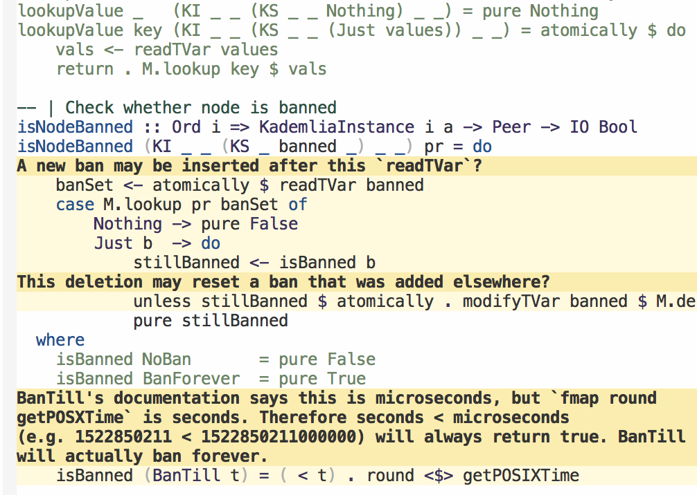

audit
=====

Code auditing mode.

## Reviewing files

Workflow:

1. Look at some code. If it's fine, run `M-x audit-ok`. This makes it
   go green.
2. If there is a problem with some code, run `M-x
   audit-comment`. Write a comment in the minibuffer and then you'll
   see an overlay of that comment in the file.

A populated file, with both comments and good code looks like:

You can delete any audit section by going to it and running `M-x
audit-delete`.

Run `audit-refresh` if you open a file and you don't see audit
overlays.

## Status buffer

Switch to your project root directory and run `M-x audit-status`. You
will get a buffer `*audit-status*`. Here is an example:

You can edit audit comments by going to the comment and hitting `e`.
